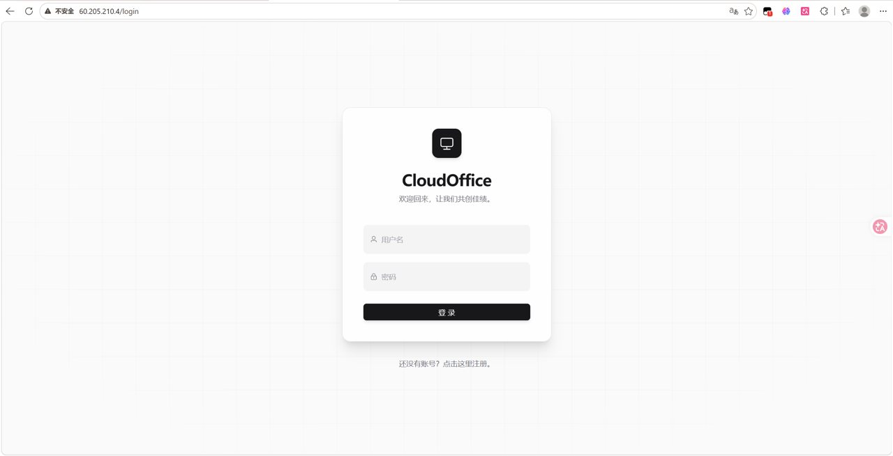
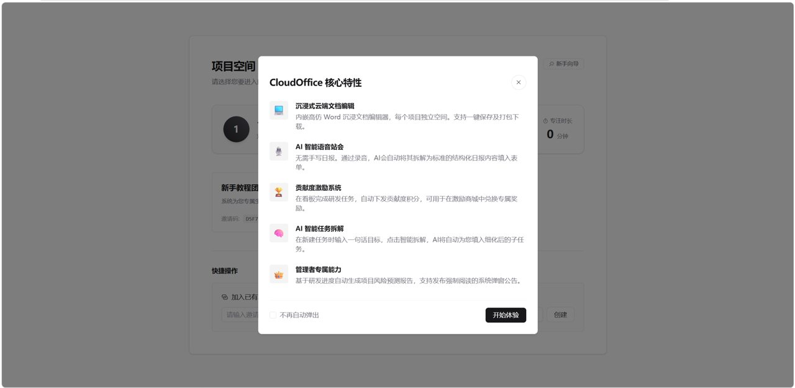
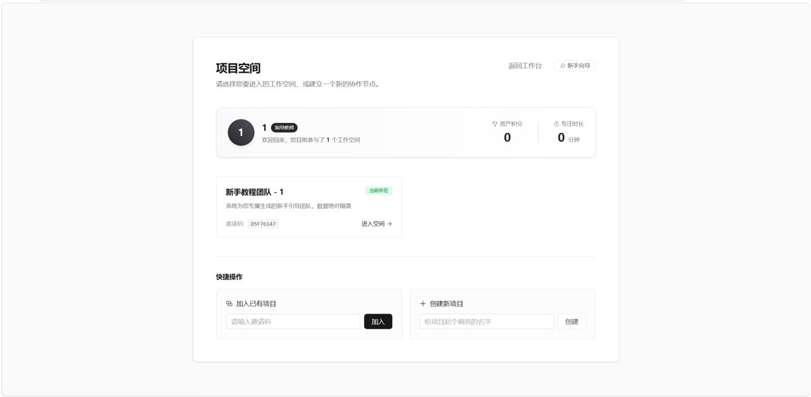

# TeamCollab Java 升级版

TeamCollab Java 升级版是 **team-collab 的 Java 升级版**。项目在原有 team-collab 团队协作原型的基础上，将后端升级为 Spring Boot + Spring Security + Spring Data JPA + MySQL，前端保留 Vue 3 + Vite 单页应用形态，并补充多团队空间、任务看板、成员管理、积分商城、每日站会、甘特图、操作日志和 AI 辅助协作能力。

本仓库定位为公开展示版：保留源码、项目介绍文档和升级对比报告；不包含真实数据库密码、JWT 密钥、API Key、默认登录后门或本地机器路径。

## 效果图预览







更多截图见：[docs/effects.md](docs/effects.md)。

## 项目文档

- 项目介绍文档：[docs/项目介绍.docx](docs/%E9%A1%B9%E7%9B%AE%E4%BB%8B%E7%BB%8D.docx)
- Java 升级对比报告：[docs/项目升级对比报告.docx](docs/%E9%A1%B9%E7%9B%AE%E5%8D%87%E7%BA%A7%E5%AF%B9%E6%AF%94%E6%8A%A5%E5%91%8A.docx)

## 升级说明

相较于旧版 team-collab 原型，本版本重点完成了以下升级：

- 后端升级：由原型后端升级为 Spring Boot Java 后端，按 Controller、Service、Repository、Entity 分层组织。
- 鉴权升级：引入 Spring Security 与 JWT，支持登录鉴权和接口权限控制。
- 数据升级：使用 MySQL 8.0 与 Spring Data JPA 管理用户、团队、任务、积分、商城、站会等业务数据。
- 协作升级：补充多团队空间、队长通知、成员管理、任务承接、专注模式、甘特图、回收站和操作日志。
- AI 升级：集成任务拆解、项目周报、站会总结、风险评估、工作量分析、需求文档撰写、代码诊断、全局分析和智能期末评级等辅助能力。
- 部署升级：公开版统一使用环境变量配置敏感信息，避免把本地密码、密钥或机器路径写入仓库。

## 功能亮点

- 注册登录：支持账号注册、登录和 JWT 鉴权。
- 团队空间：每个账号可加入或创建多个团队空间，便于管理多个项目或团队。
- 队长通知：队长发布通知后，队员端自动弹窗提醒。
- 团队看板：集中展示当前任务数量、成员数量、成员贡献排行等关键数据。
- 成员管理：队长可查看成员、添加积分、移除队员。
- 任务看板：按状态查看任务，队长可拖拽管理任务状态，逾期任务自动报警。
- 任务承接：成员可接受任务，任务卡片会显示承接成员。
- 专注模式：成员接收任务后可进入专注状态，完成后提交申请，支持 AI 审批。
- 任务编辑：队长可指定或调整任务对接成员、任务积分和任务内容。
- 外部链接：可配置 GitHub、飞书等工作链接，便于跳转到提交或协作文档。
- 积分商城：队长或导师可上架商品，成员使用任务积分兑换。
- 每日站会：成员提交每日工作详情，支持语音输入。
- 甘特图：以时间线方式查看项目任务安排。
- 回收站：删除任务后支持队长恢复。
- 操作日志：记录团队成员动态和关键操作。

## AI 能力

- AI 任务拆解：输入需求后自动拆分任务，并生成到任务看板。
- AI 项目周报：根据项目进度生成周报，支持下载 Markdown。
- AI 站会总结：汇总站会记录并生成总结。
- 风险评估：依据任务状态和成员状态评估项目风险。
- 工作量分析：评估任务量分配是否合理。
- 需求文档撰写：辅助生成项目需求文档。
- 代码诊断：对代码或项目问题进行辅助分析。
- 项目全局分析报告：生成整体项目分析。
- 智能期末评级：辅助评估团队成员表现。
- 智能 IDE 编辑模式：按项目结构树下载 ZIP 文件，支持 `<AI>自然语言需求</AI>` 指令触发 AI 编辑。

## 技术栈

- 后端：Spring Boot 2.7.18、Spring Security、Spring Data JPA、JWT、MySQL 8.0
- 前端：Vue 3、Vite、Pinia、Vue Router、Tailwind CSS
- AI 接口：通过环境变量配置 DeepSeek API Key

## 目录结构

```text
team-collab-platform/
├── backend_java/                 # Spring Boot 后端
├── frontend/                     # Vue 3 + Vite 前端
├── docs/                         # 项目介绍与升级报告
│   ├── 项目介绍.docx
│   └── 项目升级对比报告.docx
├── .env.example                  # 本地环境变量示例
├── start_teamcollab_java.bat     # Windows 一键启动脚本
└── README.md
```

## 本地配置

公开仓库不包含真实数据库密码、JWT 密钥或 API Key。运行前请在本机设置环境变量：

```powershell
$env:DB_USERNAME="root"
$env:DB_PASSWORD="your-database-password"
$env:JWT_SECRET="generate-a-long-random-secret"

# 可选：不配置时 AI 功能保持关闭
$env:DEEPSEEK_API_KEY=""
```

默认数据库名为 `teamcollab`。首次运行前请在 MySQL 中创建该数据库；如果表不存在，可导入 `backend_java/src/main/resources/schema.sql`。

## 启动后端

```bash
cd backend_java
mvn clean package -DskipTests
java -jar target/backend-0.0.1-SNAPSHOT.jar
```

后端默认运行在 `http://localhost:8000`。

## 启动前端

```bash
cd frontend
npm install
npm run dev
```

前端默认运行在 `http://localhost:5173`。

## Windows 一键启动

```powershell
.\start_teamcollab_java.bat
```

## 账号说明

公开仓库不提供默认账号、默认密码或固定登录后门。请启动后端后，通过注册入口创建本地账号。

## 上传说明

仓库已配置 `.gitignore`，默认排除 `node_modules/`、`target/`、日志文件、压缩包、PPT、PDF、非必要 Word 文档等非源码材料；当前只额外保留 `docs/项目介绍.docx` 和 `docs/项目升级对比报告.docx` 作为项目展示文档。