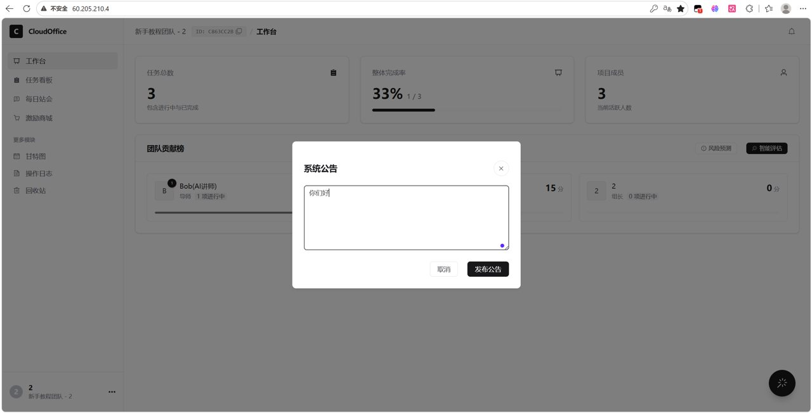
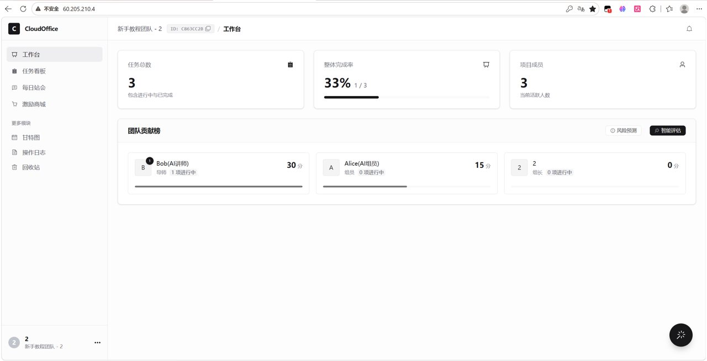

# 项目效果图

以下效果图来自 TeamCollab Java 升级版自己的项目介绍文档，仅保留 5 张代表性截图用于 GitHub 展示。

## 1. 注册登录界面

## 2. 项目亮点展示

## 3. 团队空间选择

展示多团队空间选择入口，每个账号可加入或创建多个团队空间，便于协调多个项目或团队。

## 4. 团队看板

展示当前任务数量、成员数量、成员贡献排行等团队协作核心信息。

## 5. 成员管理

展示队长对成员进行积分调整、成员管理等操作的界面。

